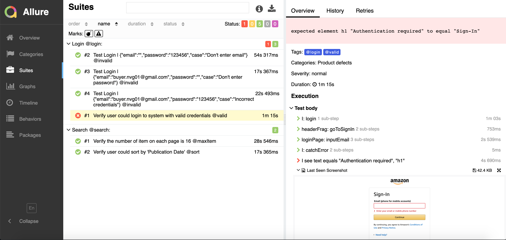
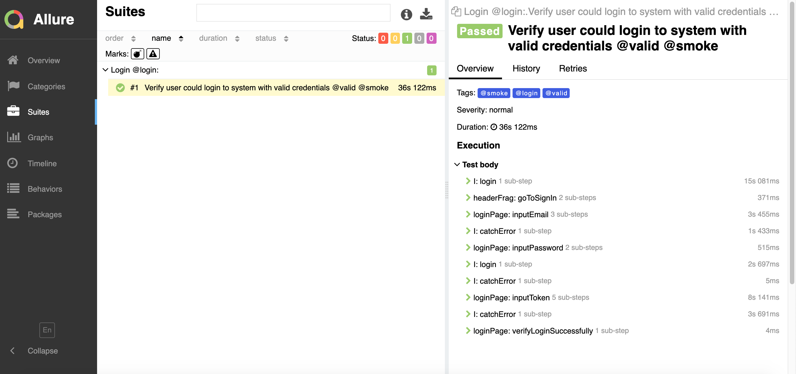

## Using CodeceptJs to test Amazon Website

- [Using CodeceptJs to test Amazon Website](#using-codeceptjs-to-test-amazon-website)
  - [A. Introduction:](#a-introduction)
  - [B. Requirements:](#b-requirements)
  - [C. Technical Information](#c-technical-information)
  - [D. Environment Setup](#d-environment-setup)
  - [E. Installation:](#e-installation)
  - [F. How to run and generate report](#f-how-to-run-and-generate-report)
  - [G. Sample Pictures](#g-sample-pictures)

### [A. Introduction](#a-introduction): 
CodeceptJS is a modern end to end testing framework with sugar syntax built on top of node-js along with some popular libraries. It bypasses execution commands to helpers. Depending on the helper enabled, your tests will be executed differently.

List of available helpers: WebDriver, Protractor, Puppeteer, Playwright, Nightmare, TestCafe

### [B. Requirements](#b-requirements):

List all scenarios are being covered in the framework

1. Login with valid account

- [:mag:Analysis]  Due to the security reason, Amazon forces customer provide OTP code once logging.

- [:white_check_mark:Solution] Writing Email API function to grab latest email from Amazon by query `'in:inbox from:account-update@amazon.com'`, then using regex to extract OTP code `(One Time Password \(OTP\):)(.\d{6})/`
  
  **Notes**: In this POC, I use Gmail as the main registration email to work with Amazon Web.

2. Login with invalid account

- [:mag:Analysis] no email, no password, invalid credential.
  
3. Search a book with keyword "apple" and language "en", and verify each pags in search result returns 16 items.

- [:mag:Analysis] To verify each pages return 16 items exactly: grab items in first page, second page and last pages. If the number of items in 3 pages are 16, the test will be passed.

4. Search a book with keyword "apple" and sort Publication date

### [C. Technical Information](#c-technical-information)
- The configuration of framework is placed in `codecept.conf.js`, to learn more details, visit: [configuration](https://codecept.io/configuration/)
- The data files are placed under `/fixtures/data`
- Apply [Puppeteer](https://codecept.io/helpers/Puppeteer/#puppeteer) as the main browser execution
- Apply [Page Object pattern](https://codecept.io/pageobjects/#pageobject) to construct the pages.
- Apply [Page fragment](https://codecept.io/pageobjects/#page-fragments) to gather all autonomous parts of a page, like modal boxes, components, widgets.
- Apply [Page Factory design pattern](https://www.youtube.com/watch?v=kuirGzhGhyw) to control page objects and page fragment (`./tests/pageFactory.js`)
- Apply [Data-driven](https://codecept.io/advanced/#data-driven-tests) for invalid login scenario
- Apply [Allure report](https://codecept.io/reports/#allure) to generate report under `output`
  

### [D. Environment Setup](#d-setup)

1. Environments

- Install Nodejs https://nodejs.org/en/
- Install an editor supported Nodejs (suggestion: Vscode)
- Upgrade your Chrome browser (as the main one) to latest.

2. Accounts

- Register an account to Amazon web.

### [E. Installation](#e-installation):

1. Deployment the source code.
   - Run command line `npm i` at the root of the folder

2. Precondition to run test cases.
   - Input account information in `.env` file (email, password, name)

* Notes: in `.env` file, remove `HEADLESS=` if you want to run in UI mode

### [F. How to run and generate report](#f-how-to-run-and-generate-report)
- Type:  `npm run test` to run all tests under folder `./tests/specs`
- Type:  `npx codeceptjs run ./tests/specs/<filename>.spec.js` to run a specific script
- Type:  `npm run test:smoke` to run scenarios marking tag `@smoke` which is highest-priority scenarios running in Chrome only.
- Type:  `npm run test: regression` to run scenarions marking tag `@regression`, this commands issues parallel-execution running in both of Firefox and Chrome
- To generate report: type `npm run report:allure`

### [G. Sample Pictures](#g-sample-pictures)

